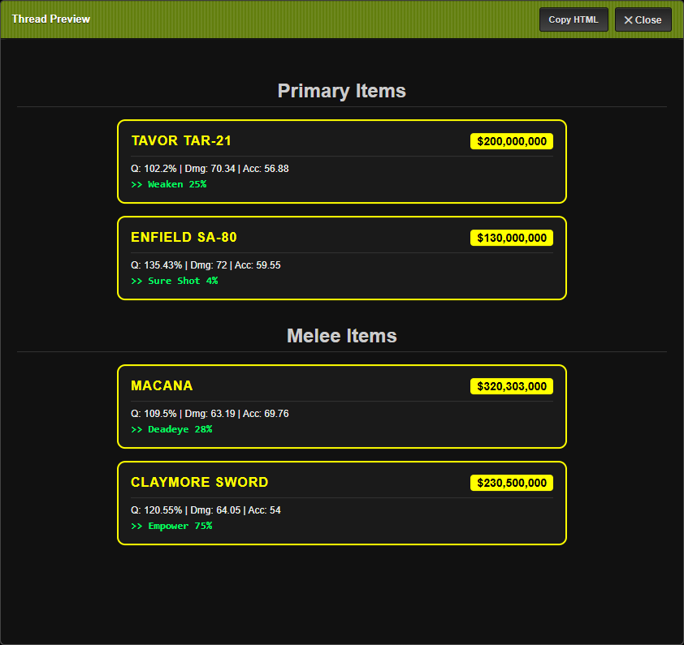
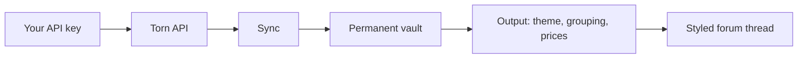
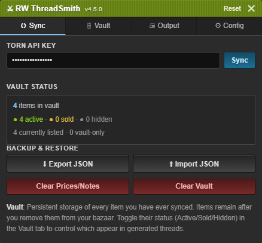
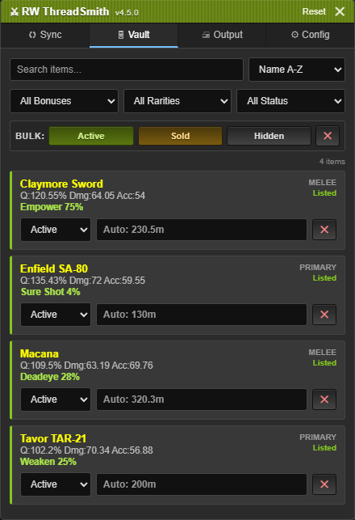
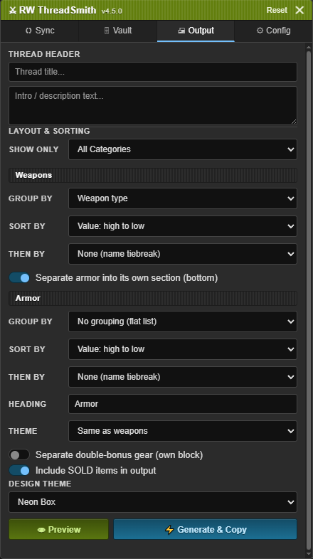
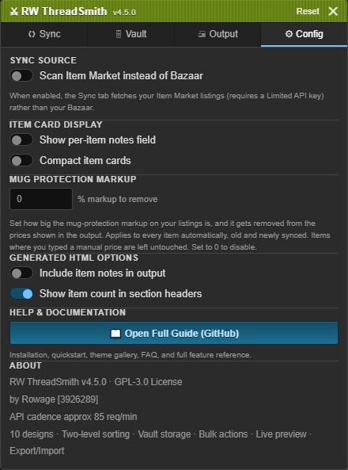

# ⚔ RW ThreadSmith

**Forum thread generator for Torn ranked-war traders.**
Sync your listings, price them, and generate a fully-styled forum thread in seconds.

[Install](#installation) &nbsp;·&nbsp; [Quickstart](#quickstart) &nbsp;·&nbsp; [Mug markup](#mug-protection-markup) &nbsp;·&nbsp; [Themes](#themes) &nbsp;·&nbsp; [FAQ](#faq)

A generated thread (Neon Box theme) - the live preview before copying.

---

> [!NOTE]
> **TL;DR** Install, open the panel on `torn.com/forums.php`, paste your API key, hit Sync. Pick a theme, set prices, and copy a fully-styled forum thread of your listings.

## What it does

RW ThreadSmith lives on Torn's forum page. It reads your bazaar or Item Market listings through the Torn API, stores them in a permanent vault, and turns them into a styled HTML thread you can paste straight into a forum post. Pick a theme, set prices, hit generate.

- **Native Torn look** - the panel matches Torn's own dark UI and tucks into a launcher button in the corner, so it feels like part of the site, not a bolted-on widget.
- **Vault storage** - every synced item is kept permanently. Items stay after you delist or sell them, so you mark them Sold/Hidden instead of losing history.
- **Mug-protection markup** - over-price your listings to deter buy-muggers, then have that markup automatically stripped from the prices shown in your thread. [Details below.](#mug-protection-markup)
- **Per-section layout & two-level sorting** - configure weapons and armor independently; group by type/rarity/bonus and sort with a primary + secondary key.
- **10 visual themes** - Neon Box, Gradient Banner, Split Bar, Thin Stripe, Classic Ledger, Modern Minimalist, Retro Terminal, Military Crate, Luxury Boutique, Frosted Glass.
- **Live preview** - see the exact thread before copying.
- **Per-item notes, bulk actions, export/import** - annotate items, set whole filtered selections at once, and back the vault up as JSON.

### At a glance

| Tab | What you do here |
|---|---|
| **Sync** | Paste your key, scan bazaar or Item Market, back up or restore. |
| **Vault** | Search, filter, set prices, statuses, and notes per item. |
| **Output** | Header, per-section grouping and sorting, theme, then generate. |
| **Config** | Sync source, mug-protection markup, display toggles. |

---

## The panel

The whole tool lives in one draggable panel on `forums.php`, opened from a launcher button in the bottom-left corner. Four tabs:

<table>
  <tr>
    <td align="center" width="50%">
       
      <b>Sync</b> - paste your API key, scan your bazaar or Item Market, see vault status and backup/restore.
    </td>
    <td align="center" width="50%">
       
      <b>Vault</b> - search, filter by bonus/rarity/status, set prices, statuses and notes per item.
    </td>
  </tr>
  <tr>
    <td align="center" width="50%">
       
      <b>Output</b> - thread header, per-section grouping &amp; sorting, theme, filters, then generate.
    </td>
    <td align="center" width="50%">
       
      <b>Config</b> - sync source, mug-protection markup, display toggles.
    </td>
  </tr>
</table>

---

## Installation

You need a userscript manager first.

| Browser | Recommended manager |
|---|---|
| Chrome / Edge / Brave | [Tampermonkey](https://www.tampermonkey.net/) |
| Firefox | [Tampermonkey](https://www.tampermonkey.net/) or [Greasemonkey](https://www.greasespot.net/) |
| Safari | [Tampermonkey](https://www.tampermonkey.net/) |

Then:

1. **[⬇ Install from Greasy Fork](https://greasyfork.org/scripts/575393)** - your manager will prompt to confirm.
2. Open any page on `torn.com/forums.php`.
3. The **⚔ launcher button** appears in the bottom-left corner. Click it to open the panel.

> [!IMPORTANT]
> The script only runs on `torn.com/forums.php`. It touches no other page or site.

---

## Quickstart

### 1. Get a Torn API key

**Torn → Settings → API Keys.** The level you need depends on your sync source:

- **Bazaar sync** (default): **Public Only** is enough.
- **Item Market sync**: a **Limited** access key is required.

### 2. Sync your items

Open the launcher, go to the **Sync** tab, paste your key, hit **Sync**.

- **Bazaar mode** fetches each item's stats and bonuses individually. Items with no bonuses are skipped automatically.
- **Item Market mode** (toggle in Config) pulls all listings in paginated batches - stats and bonuses come inline, so it's faster for large inventories.

Syncing is rate-limited (~85 req/min) to protect your key. A progress bar tracks it; you can cancel anytime and keep what's already fetched.

### 3. Review your vault

The **Vault** tab lists every synced item with its rarity color, stats, bonuses, and listing status.

- **Status** - `Active` items appear in threads, `Sold` show a SOLD badge (optional), `Hidden` are excluded.
- **Price** - leave blank to use the automatic price (your listing price with [mug markup](#mug-protection-markup) stripped, shown as `Auto: …`), or type an override like `5m`, `1.5b`, `750k`. A typed price is used exactly and is never touched by the markup.
- **Note** - enable the notes field in Config, then annotate any item.

Search, filters (bonus / rarity / status), and sort handle large inventories. Bulk actions apply to whatever is currently filtered.

### 4. Generate your thread

On the **Output** tab: set a title/description, configure grouping and sorting per section, pick a theme, then **Preview** or **Generate & Copy**. Paste the result into your forum post's **HTML source view**.

> [!TIP]
> Torn's forum editor accepts raw HTML. Use the `<>`/Source button, not the visual editor.

---

## Mug protection markup

A common Torn tactic: list an item higher than you actually want, so a buy-mugger can't snipe it cheap - if someone does buy, the inflated price covers the mug. The downside is your listing price is no longer the price you want to advertise in a thread.

This setting fixes it. In **Config → Mug Protection Markup**, enter the percentage you pad your listings by. Every output price then has that markup removed automatically.

It's a true reversal, not a flat subtraction - a +20% markup is divided back out by 1.20:

| You listed | Markup | Thread shows |
|---|---|---|
| 120M | 20% | 100M |
| 600M | 20% | 500M |
| 36M | 20% | 30M |

- **Set it once.** Applies to every item, including ones synced later - no button to press, nothing to track after a re-sync.
- **Non-destructive.** Your stored listing price is never overwritten; the markup is applied only when the price is shown. Set it back to `0` and prices revert instantly.
- **Rounded to the nearest 1M** so thread prices stay clean.
- **Manual prices are exempt** - a price you typed yourself is used as-is.

---

## Vault explained

- **Items stay after you delist them.** Removing an item from your bazaar/Item Market in Torn doesn't remove it from the vault. Mark it `Sold` or `Hidden` instead - your thread history is preserved.
- **Syncing updates prices, not history.** Each sync refreshes listing prices and adds new items it hasn't seen; this is why syncing gets faster over time.
- **The vault never auto-deletes.** Only you remove items, via ✕ or bulk remove.
- **Listed vs Vault.** Each item shows `Listed` (currently in Torn) or `Vault` (not currently listed), updated every sync.

---

## Themes

| Theme | Style |
|---|---|
| **Neon Box** | Rarity-colored glowing border on a dark card. High contrast. |
| **Gradient Banner** | Horizontal gradient bleeding from the rarity color. Clean, wide. |
| **Split Bar** | Two-tone card with a rarity underline. Structured. |
| **Thin Stripe** | Dense rows with a thick left rarity stripe. Space-efficient. |
| **Classic Ledger** | Parchment tones, serif, dashed borders. Old-school. |
| **Modern Minimalist** | Solid rarity-colored cards. Very clean. |
| **Retro Terminal** | Monospace green-on-black command-line look. |
| **Military Crate** | Impact font, dark headers, hard edges. |
| **Luxury Boutique** | Italic serif, gold price text, refined spacing. |
| **Frosted Glass** | Semi-transparent blurred dark cards. |

All themes use the item's rarity color (Yellow / Orange / Red / White) as the accent. Armor can use its own theme or match weapons.

---

## Layout and sorting

Weapons and armor have fully independent controls on the Output tab - e.g. sort weapons by value while sorting armor by rarity.

### Group by

| Group by | Result |
|---|---|
| No grouping (flat list) | One continuous list, no headers |
| Weapon type | Primary, Secondary, Melee, Other (weapons only) |
| Rarity | Yellow, Orange, Red, White |
| Weapon bonus | One group per primary bonus, headed by the bonus name |

### Sort by, then by

Each section has a primary **Sort by** and an optional **then by**. The secondary only breaks ties the primary leaves, and item name is always the final tiebreak. Picking the same field twice is blocked.

| Sort option | Available in |
|---|---|
| Value: high→low / low→high | Weapons & Armor |
| Name: A→Z / Z→A | Weapons & Armor |
| Rarity / Rarity (reversed) | Weapons & Armor |
| Weapon bonus: A→Z | Weapons & Armor |
| Bonus count: most first | Weapons & Armor |
| Quality: high→low | Weapons & Armor |
| Weapon type | Weapons only |
| Damage: high→low | Weapons only |
| Armor rating: high→low | Armor only |

Unpriced items (shown as Offer) and items missing the sorted stat sink to the bottom of that sort.

### Section options

| Setting | What it does |
|---|---|
| Show only | Restrict output to one category |
| Separate armor into its own section | Armor gets its own group, sort, heading, and theme |
| Armor heading | Custom heading text for the armor section |
| Armor theme | Different theme for armor, or match weapons |
| Separate double-bonus gear | Pulls 2+ bonus items into their own block |
| Include SOLD items | Whether Sold items appear in the thread |

---

## Vault filters

| Control | What it does |
|---|---|
| Search | Match item name |
| Bonus type | Show only items with a specific bonus |
| Rarity | Yellow / Orange / Red / White |
| Status | Active / Sold / Hidden |
| Sort | Name, Rarity, Type, Status |

---

## Config options

| Option | Default | Description |
|---|---|---|
| Scan Item Market instead of Bazaar | Off | Sync fetches Item Market listings instead of the Bazaar. Requires a Limited API key. |
| Mug Protection Markup | 0 | Percentage you pad listings by; output prices have it removed (÷ (1 + %/100), rounded to nearest 1M). Manual prices exempt. 0 = off. |
| Show per-item notes field | Off | Reveals a note input on each vault card. |
| Compact item cards | Off | Hides stats/bonuses from vault cards to save space. |
| Include item notes in output | Off | Notes appear in the generated thread. |
| Show item count in section headers | On | Adds a "(12)"-style count to section headings. |

---

## Backup and restore

**Export JSON** (Sync tab) downloads your vault, prices, notes, and markup setting as a `.json`. **Import JSON** loads it back - any browser, any machine. Importing **merges** with your existing vault (matching UIDs overwrite local copies).

- **Clear Prices/Notes** wipes manual prices and notes, keeps vault items.
- **Clear Vault** removes everything.

> [!CAUTION]
> Clear Vault is irreversible and deletes all items, prices, notes, and statuses. Export a backup first.

---

## FAQ

**Nothing shows up after syncing.**
Check your API key matches your sync source (Public for Bazaar, Limited for Item Market). The script only stores items that have weapon/armor bonuses - plain unmodded items are skipped on purpose.

**My weapons are on the Item Market, not the Bazaar.**
Enable **Scan Item Market instead of Bazaar** in Config before syncing, and use a Limited key.

**My thread prices are higher than what I want to sell for.**
You pad your listings for mug protection. Set **Mug Protection Markup** in Config to your padding percentage. See [Mug protection markup](#mug-protection-markup).

**The markup removed too much / too little.**
It divides by your percentage (the correct reversal of a markup), not subtract it. Make sure the percentage matches what you actually pad by. Output is rounded to the nearest 1M.

**My Torn prices changed but the thread shows the old price.**
Sync again to refresh listing prices. A manual price you typed overrides the listing price until you clear it.

**How do "Sort by" and "then by" interact?**
Primary decides the order; secondary only breaks ties the primary left; name is the final tiebreak. Order matters (bonus-then-value ≠ value-then-bonus). The same field can't be picked twice.

**The panel opened off-screen / too tall.**
It clamps into view on open, on tab switch, and on window resize. Use **Reset** in the panel header to snap it back to the bottom-left. Drag it by the title bar to reposition; the position is remembered.

**Can I use this on multiple characters?**
The vault is stored per browser profile. Different profiles = separate vaults. Use Export/Import to move or separate inventories.

**How do I paste the output into a forum post?**
Use the forum editor's HTML source mode (`<>` / "Source"), then paste there - not the visual editor.

**Can I run this outside forums.php?**
No, it's restricted to `torn.com/forums.php` by design - that's where threads are written.

---

## Permissions used

| Permission | Why |
|---|---|
| `GM_xmlhttpRequest` | Fetch item data from the Torn API (bypasses CORS) |
| `GM_setValue` / `GM_getValue` | Persist vault, prices, notes, and settings |
| `GM_setClipboard` | Copy generated HTML on Generate |

No data is sent anywhere except `api.torn.com`. Nothing is collected. No external servers.

---

## Changelog

### v4.5.0

**Added**
- **Mug Protection Markup** (Config): strip the mug-protection padding from your listing prices in the output automatically - set once, applies to every item (old and newly synced), non-destructive, rounded to the nearest 1M, manual prices exempt.

**Changed**
- **Redesigned the panel to match Torn's native dark-mode UI** - striped title bar, tabbed sub-nav with a blue active indicator, native button styling, and larger, higher-contrast text (panel text now meets WCAG AA).
- **New launcher**: a round button in the bottom-left opens the panel (anchored bottom-left) and hides while it's open. The panel stays draggable, remembers its position, and re-clamps into view on tab switch and window resize.
- Vault price field now holds only your manual override; blank uses the automatic post-markup price. The markup setting is included in Export/Import.

### v4.4.0

**Added**
- Two-level sorting per section (primary **Sort by** + optional **then by**, with name as the final tiebreak).
- Same-field protection in the "then by" list. `Rarity (reversed)` sort option.

**Changed**
- Sort comparators rebuilt to chain cleanly.

### v4.3.0

**Added**
- Independent layout/sorting per section; **Group by** (none / type / rarity / bonus); expanded sort options; **Separate armor** with its own grouping/sorting/heading/theme; **Separate double-bonus gear**; unpriced/missing-stat items sink in value/stat sorts.

**Changed**
- Output "Layout" became a fuller "Layout & Sorting" panel; old single grouping dropdown superseded (saved grouping carries over).

### v4.2.0

**Added**
- Item Market sync mode (paginated `/v2/user/itemmarket`, faster for large inventories; requires a Limited key).

**Changed**
- Config tab reorganised with a Sync Source section; API-key note updated.

### v4.1.0

**Added**
- Guide button; viewport-aware width; saved-position validation; drag clamping; SPA navigation guard.

**Changed**
- Raised z-index and contrast across the UI.

**Fixed**
- Frosted Glass Safari prefix; unified note handling; entity-encoded special characters and emoji.

### v4.0.0

**Added**
- Permanent vault; status tracking; tabbed interface; search/filter/sort; bulk actions; per-item notes; live preview; Export/Import; listing-presence tracking; sync progress + summaries; vault/generation stats; compact mode; include-sold toggle.

**Changed**
- Unified theme system; throttle 750→700ms; storage keys `rw_*`→`rwts_*`; MIT→GPL-3.0; full UI redesign.

**Removed**
- 24-hour cache expiry; auto-clear prices on sync.

**Fixed**
- Prices/notes persist across syncs; old cache auto-migrated.

---

## License

GPL-3.0-or-later · Rowage [3926289] · 2026

Free to use, modify, and redistribute under the terms of the GPL-3.0 license.
